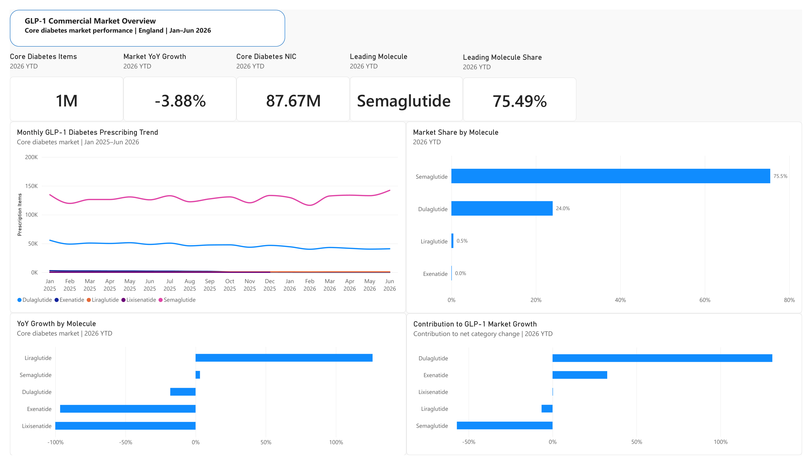
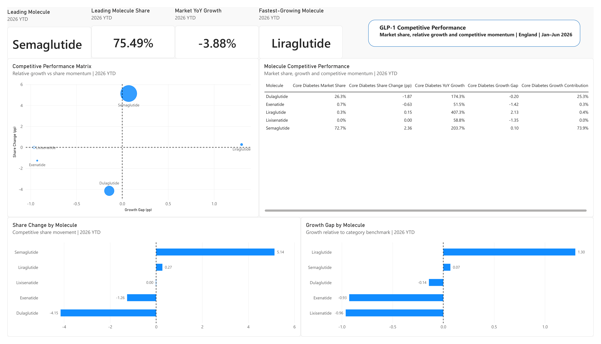
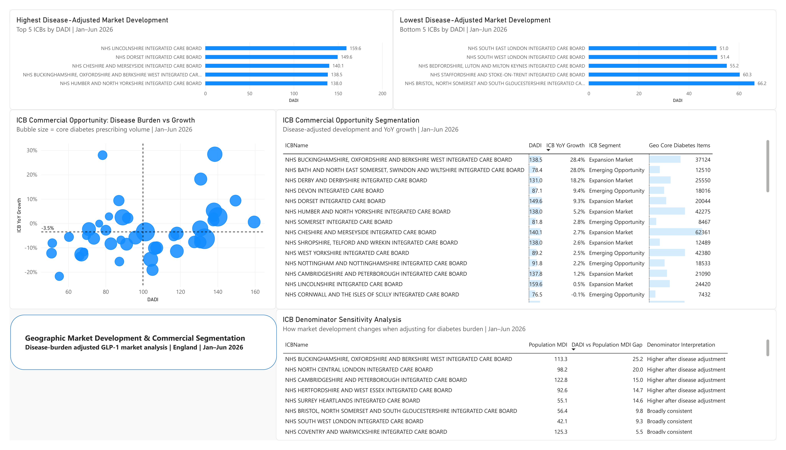
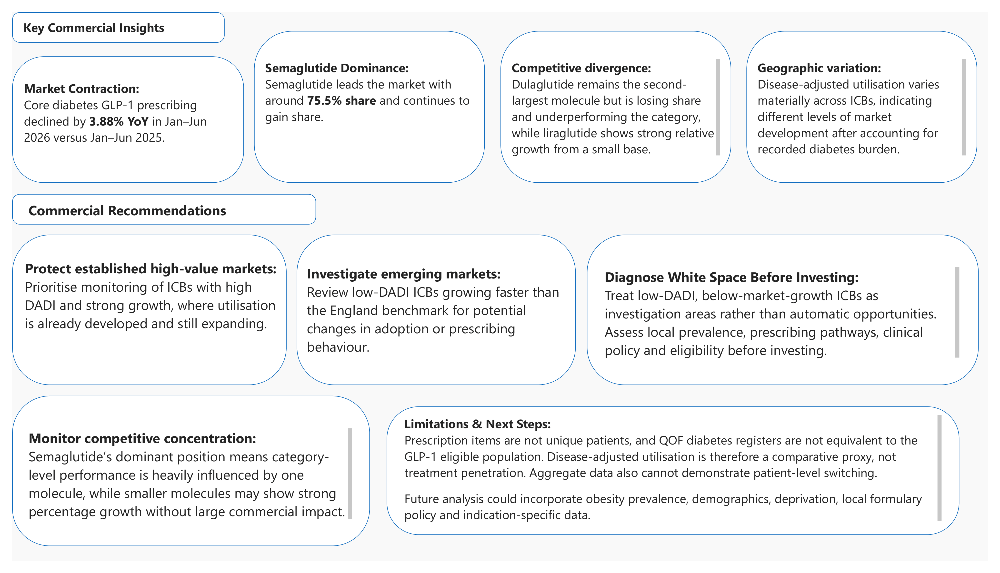
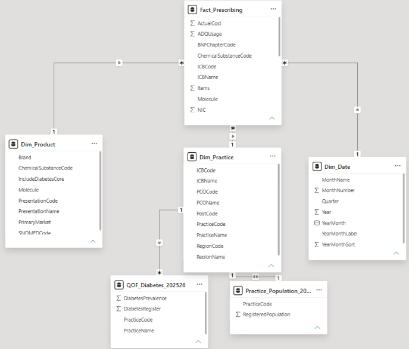

# UK GLP-1 Commercial Opportunity & Disease Burden Analysis

Power BI commercial analytics project analysing NHS GLP-1 prescribing trends, competitive performance, disease-adjusted utilisation and geographic opportunity across England.

---

## Project Overview

This project uses publicly available NHS prescribing, GP registered-population and Quality and Outcomes Framework (QOF) diabetes prevalence data to analyse the commercial dynamics of the GLP-1 diabetes market in England.

The analysis evaluates:

- Market growth and prescribing trends
- Competitive market share by molecule
- Share momentum and relative growth performance
- Contribution to category-level change
- Geographic prescribing intensity
- Population-adjusted market development
- Disease-adjusted market development
- ICB-level commercial segmentation
- Sensitivity of commercial interpretation to the choice of denominator

A key analytical focus is the comparison between population-adjusted and disease-adjusted prescribing intensity.

Rather than relying only on prescribing per registered population, the project incorporates recorded diabetes burden to test whether conclusions about geographic market development change when a more disease-relevant denominator is used.

---

## Business Question

> **How is the GLP-1 market evolving across England, which products are gaining competitive position, and which geographic markets show the strongest commercial potential after accounting for local diabetes burden?**

Supporting questions:

1. How has the core diabetes GLP-1 market evolved over time?
2. Which molecules are gaining or losing competitive position?
3. How does prescribing intensity vary across Integrated Care Boards (ICBs)?
4. Does the interpretation of market development change after accounting for recorded diabetes burden?
5. Which geographic markets warrant further commercial investigation based on development and growth?

---

## Dashboard Pages

### 1. Executive Market Overview

Provides a high-level view of the core diabetes GLP-1 market.

Key metrics include:

- Core diabetes prescribing items
- Year-on-year market growth
- Net Ingredient Cost (NIC)
- Leading molecule
- Leading molecule market share
- Monthly prescribing trends
- Market share by molecule
- Molecule-level YoY growth
- Contribution to net category change

For Jan–Jun 2026, the analysis identified approximately:

- **1M core diabetes GLP-1 prescription items**
- **-3.88% YoY market growth**
- **£87.67M NIC**
- **Semaglutide as the leading molecule**
- **~75.5% market share for Semaglutide**

---

### 2. Competitive Performance

Evaluates the competitive position of GLP-1 molecules using:

- Market Share
- Share Change
- YoY Growth
- Market YoY Growth
- Growth Gap
- Growth Contribution

The **Competitive Performance Matrix** compares:

- **X-axis:** Growth Gap versus category growth
- **Y-axis:** Market Share Change
- **Bubble size:** Current prescribing volume

This distinguishes molecules that are gaining share and outperforming the market from those losing competitive momentum.

The analysis also demonstrates that strong percentage growth does not necessarily imply large commercial impact when a molecule is growing from a very small market base.

---

### 3. Geographic Market Development & Commercial Segmentation

This page evaluates market development across England at ICB level using both population-adjusted and disease-adjusted prescribing intensity.

#### Population-Adjusted Utilisation

Population prescribing intensity is calculated as:

**Core Diabetes Items / Registered Population × 1,000**

This is converted into a population-based Market Development Index:

**Population MDI = (ICB Items per 1,000 Population / England Items per 1,000 Population) × 100**

Interpretation:

- **MDI > 100** — utilisation above the England benchmark
- **MDI = 100** — approximately in line with England
- **MDI < 100** — utilisation below the England benchmark

#### Disease-Adjusted Utilisation Rate

The main analytical extension of the project is the incorporation of recorded diabetes burden using QOF prevalence data.

**DAUR = (Core Diabetes GLP-1 Items / Recorded Diabetes Register) × 1,000**

DAUR should not be interpreted as treatment penetration.

Prescription items are not unique patients, and the QOF diabetes register does not represent the population clinically eligible for GLP-1 therapy.

Instead, DAUR is used as a comparative measure of prescribing intensity relative to recorded diabetes burden.

#### Disease-Adjusted Development Index

Disease-adjusted utilisation is benchmarked against England using:

**DADI = (ICB DAUR / England DAUR) × 100**

Interpretation:

- **DADI > 100** — prescribing intensity relative to recorded diabetes burden is above the England benchmark
- **DADI = 100** — approximately in line with England
- **DADI < 100** — below the England benchmark

---

## Denominator Sensitivity Analysis

A central analytical question in this project is:

> **Does the interpretation of market development change when the denominator changes from general population to recorded diabetes burden?**

The project compares:

**Population MDI vs DADI**

The difference is calculated as:

**DADI vs Population MDI Gap = DADI - Population MDI**

Interpretation:

- **Positive gap** — market development appears higher after accounting for diabetes burden
- **Negative gap** — market development appears lower after accounting for diabetes burden
- **Small gap** — both denominators produce broadly similar conclusions

This demonstrates that geographic commercial interpretation can be sensitive to methodological choices.

An ICB that appears highly developed relative to its total registered population may appear closer to the national average once local diabetes prevalence is considered.

---

## ICB Commercial Opportunity Segmentation

ICBs are segmented using:

- **X-axis:** Disease-Adjusted Development Index (DADI)
- **Y-axis:** ICB YoY Growth
- **Bubble size:** Core diabetes prescribing volume

Growth is benchmarked against England rather than zero growth.

The England ICB YoY growth benchmark for the analysed period was approximately **-3.51%**.

This creates four segments.

### Emerging Opportunity

**Low DADI + Growth above England**

The market remains below the national disease-adjusted development benchmark but is growing faster than England.

This may indicate accelerating adoption from a relatively underdeveloped base.

### Expansion Market

**High DADI + Growth above England**

The market already demonstrates relatively high utilisation and continues to outperform national growth.

These markets may represent strong established areas with continued expansion.

### Investigate Barriers

**Low DADI + Growth below England**

Persistently low disease-adjusted utilisation combined with weak growth may reflect:

- Local prescribing pathways
- Clinical eligibility
- Access limitations
- Formulary decisions
- Prescribing behaviour
- Genuine commercial whitespace

Additional evidence is required before treating these markets as commercial opportunities.

### Established / Mature

**High DADI + Growth below England**

Current utilisation remains relatively strong, but incremental growth is weaker than the national benchmark.

These markets may require greater emphasis on competitive defence and retention rather than category expansion.

---

### 4. Commercial Insights, Recommendations & Limitations

Summarises the main commercial findings, strategic implications, methodological limitations and areas for future development.

---

## Key Commercial Insights

### Market Contraction

Core diabetes GLP-1 prescribing declined by approximately **3.88% YoY** in Jan–Jun 2026 compared with Jan–Jun 2025.

### Semaglutide Dominance

Semaglutide leads the core diabetes GLP-1 market with approximately **75.5% market share** and continues to gain competitive share.

### Competitive Divergence

Dulaglutide remains the second-largest molecule but is losing share and underperforming the category.

Liraglutide shows strong relative percentage growth, but from a much smaller market base.

### Geographic Variation

Disease-adjusted utilisation varies materially across ICBs, demonstrating that GLP-1 market development is geographically heterogeneous.

### Denominator Sensitivity

Population-adjusted and disease-adjusted measures do not always produce the same interpretation.

Accounting for recorded diabetes burden can materially change the apparent level of market development for individual ICBs.

---

## Commercial Recommendations

### Protect Established High-Value Markets

Monitor ICBs with high DADI and above-market growth, where utilisation is already developed and prescribing continues to expand.

### Investigate Emerging Markets

Review low-DADI ICBs growing faster than the England benchmark for evidence of changing adoption or prescribing behaviour.

### Diagnose White Space Before Investing

Treat low-DADI, below-market-growth ICBs as areas for investigation rather than automatic commercial opportunities.

Further analysis should consider:

- Disease prevalence
- Clinical eligibility
- Local prescribing pathways
- Formulary policy
- Access conditions
- Demographics

### Monitor Competitive Concentration

Semaglutide's dominant position means category-level performance is heavily influenced by a single molecule.

Smaller molecules may demonstrate high percentage growth without generating equivalent commercial impact due to their limited current market share.

---

## Data Sources

The analysis integrates three publicly available NHS datasets.

### NHS Business Services Authority — English Prescribing Dataset

Monthly primary-care prescribing data containing:

- Practice
- ICB
- BNF chemical substance
- BNF presentation
- Prescription items
- Quantity
- Net Ingredient Cost
- Actual Cost
- SNOMED code

Source:  
https://www.nhsbsa.nhs.uk/prescription-data/prescribing-data/english-prescribing-data-epd

### NHS Patients Registered at a GP Practice

Used to provide a registered-population denominator at GP practice level.

June 2026 population data was used for the geographic analysis.

Source:  
https://digital.nhs.uk/data-and-information/publications/statistical/patients-registered-at-a-gp-practice/june-2026

### Quality and Outcomes Framework — Diabetes Prevalence

QOF 2025–26 GP practice-level diabetes data was used to incorporate recorded disease burden.

Relevant variables include:

- Practice Code
- Diabetes Register
- Diabetes Prevalence

Source:  
https://digital.nhs.uk/data-and-information/publications/statistical/quality-and-outcomes-framework-achievement-prevalence-and-exceptions-data/2025-26

---

## Analysis Period

Prescribing analysis covers:

**January 2025 – June 2026**

For year-on-year analysis:

**Jan–Jun 2026 is compared with Jan–Jun 2025.**

QOF diabetes prevalence represents the **2025–26 reporting period**, while registered population uses the **June 2026 snapshot**.

---

## Market Scope

The core market analysis focuses on GLP-1 receptor agonists used within the diabetes market.

The prescribing extract includes:

- Semaglutide
- Dulaglutide
- Liraglutide
- Exenatide
- Lixisenatide

Product-level mapping was used to distinguish diabetes-focused presentations from weight-management products.

Examples of weight-management products were excluded from the core diabetes analysis to improve consistency with the diabetes prevalence denominator.

The project therefore distinguishes between:

**All selected GLP-1 prescribing**

and

**Core Type 2 Diabetes GLP-1 prescribing**

---

## Product Mapping

Chemical-level filtering alone was not sufficient because some GLP-1 molecules have products associated with different treatment pathways.

A product dimension was therefore constructed using presentation-level information.

Fields include:

- PresentationCode
- PresentationName
- ChemicalSubstanceCode
- Molecule
- Brand
- PrimaryMarket
- IncludeDiabetesCore
- SNOMEDCode

Products were classified into:

- Type 2 Diabetes
- Weight Management
- Requires Review

This product mapping forms an important methodological component of the analysis.

---

## Data Preparation

Data preparation was completed in Power Query.

Key transformation steps included:

- Filtering prescribing data to selected GLP-1 molecules
- Harmonising historical and later NHS prescribing schemas
- Standardising column names
- Converting monthly periods into date format
- Correcting numeric data types and decimal interpretation
- Appending monthly prescribing files
- Constructing product-level classification
- Creating date, product and practice dimensions
- Aggregating registered population to GP practice level
- Integrating QOF diabetes register data
- Handling unmatched practice codes
- Excluding practices without valid denominators from normalised geographic measures

Raw prescribing records were retained for overall market analysis where appropriate.

Practices without valid population or disease-prevalence denominators were excluded only from the relevant normalised geographic measures.

---

## Data Model

The model follows a dimensional structure centred on prescribing activity.

Core tables include:

- Dim_Date
- Dim_Product
- Dim_Practice
- Fact_Prescribing
- Practice_Population_202606
- QOF_Diabetes_202526

Relationships are primarily based on:

- YearMonth
- PresentationCode
- PracticeCode

The shared `Dim_Practice` dimension connects prescribing activity with registered population and QOF disease-prevalence data.

This allows transactional prescribing, demographic and disease-burden information to be analysed within a consistent geographic context.

---

## Key Measures

### Core Diabetes Items

Total prescription items associated with presentations classified as core diabetes GLP-1 products.

### Market Share

**Molecule Core Diabetes Items / Total Core Diabetes Market Items**

### YoY Growth

**(Current Period Items - Prior-Year Items) / Prior-Year Items**

### Growth Gap

**Molecule YoY Growth - Market YoY Growth**

Used to determine whether a molecule is outperforming or underperforming category growth.

### Share Change

**Current Market Share - Prior-Year Market Share**

Reported in percentage points.

### Growth Contribution

**Change in Molecule Items / Change in Total Market Items**

When the overall category contracts, contribution must be interpreted carefully because growing molecules may offset part of the category decline.

### Population MDI

**(ICB Items per 1,000 Population / England Items per 1,000 Population) × 100**

### DAUR

**(Core Diabetes Items / Diabetes Register) × 1,000**

### DADI

**(ICB DAUR / England DAUR) × 100**

---

## Critical Interpretation

This project deliberately avoids interpreting prescribing data as direct evidence of patient-level behaviour or future commercial demand.

### Prescription Items Are Not Patients

One patient may receive multiple prescription items during the analysis period.

Therefore prescribing volume should not be interpreted as patient count.

### Diabetes Register Is Not GLP-1 Eligibility

The QOF diabetes register measures recorded diabetes burden.

It does not identify patients clinically eligible for GLP-1 therapy.

Therefore **GLP-1 Items / Diabetes Register** is a comparative utilisation proxy rather than treatment penetration.

### Aggregate Data Does Not Demonstrate Switching

If one molecule declines while another grows, this may be consistent with market-level substitution.

However, aggregate prescribing data cannot demonstrate that individual patients switched between therapies.

### Multiple Indications Create Measurement Challenges

Some GLP-1 products may be associated with treatment pathways beyond diabetes.

Presentation-level classification reduces this problem but cannot fully replicate patient-level indication data.

### Temporal Alignment Is Imperfect

Prescribing data is monthly, whereas QOF prevalence is annual and registered population is a point-in-time snapshot.

The denominator should therefore be interpreted as contextual rather than perfectly contemporaneous with every prescribing month.

---

## Limitations

Key limitations include:

- Prescription items do not represent unique patients
- NIC should not be interpreted as manufacturer revenue
- QOF diabetes registers do not represent the clinically eligible GLP-1 population
- Disease-adjusted utilisation is not treatment penetration
- Patient-level therapy switching cannot be observed
- Product indication cannot always be identified perfectly from aggregate prescribing records
- QOF prevalence and prescribing periods are not perfectly temporally aligned
- Local formulary policy, supply issues, clinician preference and access conditions are not directly observed
- Disease prevalence itself depends on diagnosis and recording practices

---

## Future Development

Future analysis could incorporate:

- Obesity prevalence
- Age structure
- Socioeconomic deprivation
- Local formulary policy
- Prescribing guidelines
- Indication-specific utilisation
- Patient-level longitudinal data where appropriate and available
- Additional disease burden measures
- Wider incretin-market competitors such as dual GIP/GLP-1 therapies
- Competitive concentration indicators such as HHI

These additions could improve the interpretation of geographic market development and commercial opportunity.

---

## Tools & Skills Demonstrated

### Business Intelligence

- Power BI
- DAX
- Power Query
- Interactive dashboard design
- KPI development
- Geographic segmentation

### Data Analysis

- Market share analysis
- Year-on-year growth
- Growth contribution
- Share momentum
- Relative growth benchmarking
- Market development indexing
- Disease-adjusted utilisation
- Denominator sensitivity analysis

### Data Modelling

- Dimensional modelling
- Star-schema principles
- Fact and dimension tables
- Multi-source data integration
- Practice-level relationship modelling
- Data harmonisation across schema changes

### Commercial Analytics

- Competitive performance analysis
- Market segmentation
- Portfolio interpretation
- Geographic opportunity screening
- Commercial recommendation development
- Critical interpretation of proxy measures

---

## Repository Structure

    UK-GLP1-Commercial-Opportunity-Disease-Burden-Analysis/
    │
    ├── README.md
    │
    ├── images/
    │   ├── executive_overview.png
    │   ├── competitive_performance.png
    │   ├── geographic_opportunity.png
    │   ├── commercial_insights.png
    │   └── data_model.png
    │
    ├── documentation/
    │   └── GLP1_Commercial_Analytics_Report.pdf
    │
    └── data/
        └── README.md

Raw NHS prescribing files are not included in this repository due to file size.

The `data` folder documents the public data sources and transformation approach used in the project.

The Power BI `.pbix` source file is available upon request.

---

## Dashboard Summary

The final dashboard consists of four analytical pages:

1. **Executive Overview**  
   Market size, growth, cost, leadership, trends and market share.

2. **Competitive Performance**  
   Share momentum, relative growth, growth contribution and molecule-level competitive positioning.

3. **Geographic Opportunity**  
   Disease-adjusted market development, ICB growth, commercial segmentation and denominator sensitivity.

4. **Commercial Insights, Recommendations & Limitations**  
   Strategic interpretation, commercial implications, analytical limitations and future development.

---

## Author

**Razaqa Muhammad Hanif Subagyo**

MSc Management of Information Systems & Digital Innovation  
Warwick Business School — University of Warwick

LinkedIn:  
https://www.linkedin.com/in/razaqasubagyo

GitHub:  
https://github.com/razaqasubagyo

---

## Disclaimer

This is a self-directed portfolio project using publicly available NHS data.

The analysis is intended to demonstrate commercial analytics, data modelling and business intelligence capabilities.

It should not be interpreted as clinical guidance, market forecasting, patient-level analysis or a recommendation for pharmaceutical sales activity.
